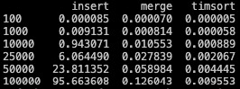
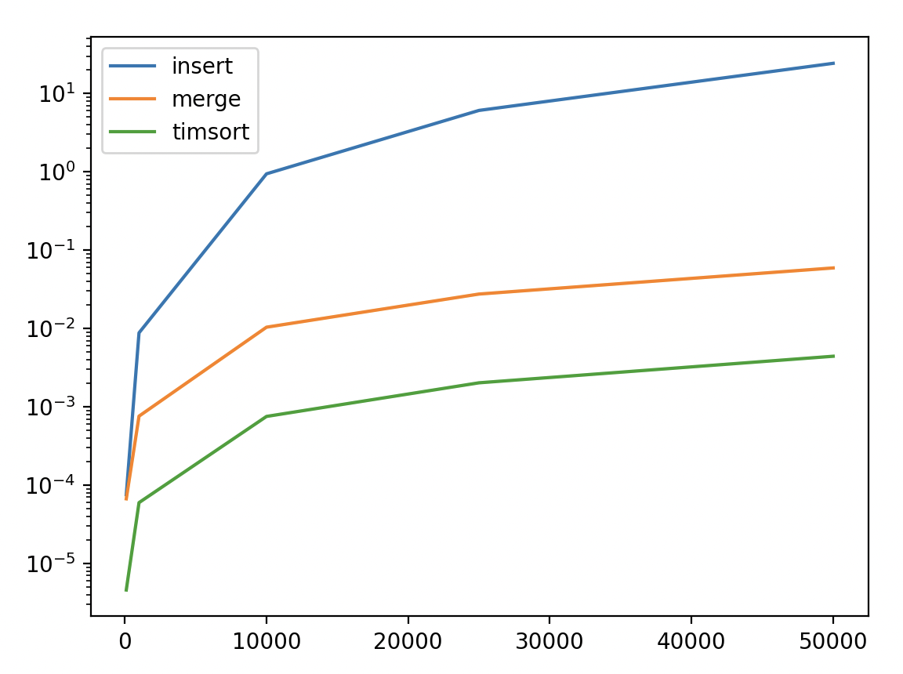

# Conclusions

I've calculated the duration for three sorting algorithms (insertion sort, merge sort, and timsort) across various data sizes (100, 1,000, 10,000, 25,000, 50,000, and 100,000 elements). Here's my analysis:

## Insertion Sort:

It's quite fast for small data sets (for instance, it only took 0.000085 seconds for 100 elements).
However, its performance dramatically decreases as the size of the data increases. For 100,000 elements, it took 95.663608 seconds, which is about 1.6 minutes. This indicates that insertion sort is not suitable for large data sets.

## Merge Sort:

It shows faster and more scalable performance for all data sizes compared to insertion sort.
Given that the complexity of merge sort is O(n log n), its performance scales much better with increased data size than insertion sort. For example, it only took 0.126043 seconds for 100,000 elements, which is significantly faster compared to insertion sort.

## Timsort:

This is the algorithm used by Python's built-in sort() function and can be considered a variation of merge sort.
It has the fastest performance across all tested data sizes. This demonstrates that timsort is highly efficient for both small and large data sets. For instance, it took only 0.009553 seconds for 100,000 elements.
Overall Conclusion:

### These data show that while insertion sort might be suitable for small data sets, it is not appropriate for large ones.

### Merge sort performs quite well with large data sets and is often the preferred method for them.

### Timsort emerges as the algorithm with the best performance for both small and large data sets, making it an excellent choice for a general-purpose sorting algorithm.
